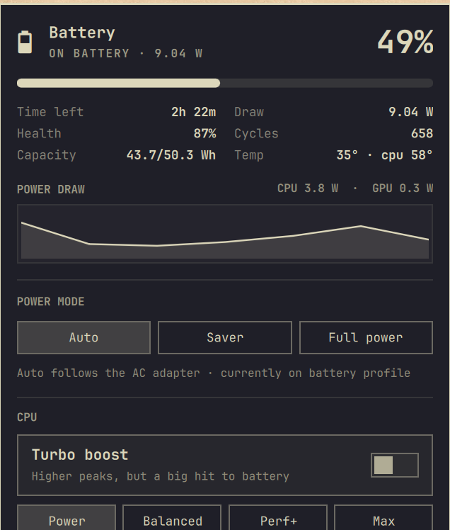

# Battery+

A richer replacement for Omarchy's built-in `omarchy.power` bar widget.
Left-click opens a panel anchored under the icon (like the Wi-Fi and display
panels) that shows battery health and live power data, and — once a power
manager is installed — lets you tune CPU and per-device power saving without
leaving the bar.



## Panel contents

- **Hero** — battery glyph, charge %, and live mode (`ON BATTERY · 9.6 W`).
- **Charge bar** — animated; pulses while charging.
- **Stats** — time remaining, draw, health, cycle count, capacity (Wh), temperature.
- **Power draw** — a rolling sparkline of recent samples: Intel RAPL package
  power when it's readable, otherwise the battery's own reported draw.
- **Power mode** — `Auto` / `Saver` / `Full power`, backed by TLP
  (`tlp start` / `tlp bat` / `tlp ac`).
- **CPU** — turbo-boost toggle and an energy-preference (EPP) selector.
- **Top consumers** — the busiest process groups, with bars.
- **Device power saving** — Wi-Fi powersave, PCIe runtime PM, USB autosuspend
  (HID devices excluded), and audio-codec powersave. Each row has an **(i)**
  that explains what the setting does and its tradeoffs before you turn it on.
  Toggles take effect immediately; **Keep after reboot** writes the setting to a
  plugin-owned drop-in (`/etc/tlp.d/02-battery-plus.conf`) so it persists.
- **PowerTOP scan** and **Full dashboard** buttons open a floating terminal.
- **Sleep** — opt-in tracking of real battery drain during suspend: watts and
  %/hour for the last sleep, plus a rolling average. See below.
- **Wi-Fi suspend-fix banner** — appears only when it's actually needed. See below.

Right-click the bar icon toggles the inline percentage.

The battery icon, tooltip, and hero read live state from
`Quickshell.Services.UPower`, so they are always current. The heavier
data (RAPL, CPU, process list, tunable state) is gathered by a small shell
helper that polls while the panel is open plus a slow background tick.

## Requirements

- Omarchy (the Quickshell-based shell) with a laptop battery.
- `jq` (ships with Omarchy).
- Optional, for the tuning half: **TLP** and **powertop**. The bundled
  installer in `extras/power-tuning/` sets these up. Until a power manager is
  present the panel is a read-only monitor and the tuning sections are hidden.

## Install

```bash
omarchy plugin add https://github.com/amikeal/omarchy-battery-plus.git --enable
```

Enabling adds the widget to the right side of the bar. If you'd rather keep
the stock widget too, move or remove one with `omarchy bar`.

By hand instead: clone into `~/.config/omarchy/plugins/io.github.amikeal.battery-plus/`,
then `omarchy-shell shell rescanPlugins` and `omarchy plugin enable io.github.amikeal.battery-plus`.

Remove with `omarchy plugin remove io.github.amikeal.battery-plus` (re-enable
`omarchy.power` afterwards if you want the stock widget back).

## Power tuning (optional)

```bash
~/.config/omarchy/plugins/io.github.amikeal.battery-plus/extras/power-tuning/apply.sh
```

This installs `tlp` + `powertop`, masks `power-profiles-daemon`, writes a TLP
drop-in, installs the privileged helper (below), and adds a udev rule so the
panel can read Intel RAPL counters without root. `extras/power-tuning/revert.sh`
undoes it.

> **The TLP drop-in (`tlp-macbookair.conf`) is tuned for the Intel
> MacBook Air (9,1 / T2)** — Wi-Fi powersave on battery, PCIe ASPM, no CPU
> turbo on battery, the Apple NVMe kept out of runtime PM, and so on. On other
> hardware, review it before applying or drop in your own `/etc/tlp.d/` file;
> the plugin only cares that TLP is running, not what's in the config.

Masking `power-profiles-daemon` disables the profile buttons in the stock
`omarchy.power` widget — Battery+'s Power-mode control replaces them.

## Sleep-drain tracking (optional)

```bash
~/.config/omarchy/plugins/io.github.amikeal.battery-plus/extras/sleep-tracking/apply.sh
```

Installs a `systemd-sleep` hook that records battery capacity/charge/voltage
immediately before and after every suspend, and appends one measured line to
`/var/log/battery-plus-sleep.log`. The panel's **Sleep** section reads that
log — no TLP dependency, works standalone. `extras/sleep-tracking/revert.sh`
removes the hook (the log is left in place). The panel also offers to install
this inline, under "Sleep", if it isn't set up yet.

## Wi-Fi suspend fix — Intel MacBook Air 9,1 / T2 (conditional)

The panel watches `/sys/power/suspend_stats` for a specific, known bug: on
this machine's BCM4377b Wi-Fi adapter (PCI `14e4:4488`), leaving the
`brcmfmac` driver bound during suspend times out its PCI power-management
call (errno `-5`), which aborts suspend and — left unfixed — can crash-loop
suspend/resume continuously, draining the battery in hours instead of days.

If that chip is present *and* the failure has actually been observed *and*
the fix isn't already installed, a banner appears at the top of the panel
explaining it with a one-click install. Nothing shows up if you don't have
this chip, or if you have it but haven't hit the bug.

```bash
~/.config/omarchy/plugins/io.github.amikeal.battery-plus/extras/wifi-suspend-fix/apply.sh
```

Installs a `systemd-sleep` hook that unloads `brcmfmac`/`brcmfmac_wcc` before
suspend and reloads them after resume, plus a udev rule that stops the card
being armed as an ACPI wakeup source (wake-on-wireless-LAN isn't used here).
`extras/wifi-suspend-fix/revert.sh` undoes both.

## Privileges

The Power-mode, CPU, and device toggles need root. The installer copies
`bin/battery-plus-priv` to **`/usr/local/bin/battery-plus-priv`** (owned by
root) and whitelists exactly that path in `/etc/sudoers.d/battery-plus`, so
the panel invokes it through `sudo -n` with no prompt. Every branch of that
helper is a fixed operation on a fixed sysfs path or a whitelisted TLP key —
no argument is executed or used to build a path. Without the helper the panel
falls back to a `pkexec` prompt per action.

Nothing else is passwordless — `tlp`, `tlp-stat`, and `powertop` are not in
the sudoers file, deliberately. Running them by hand still prompts for your
password; the "PowerTOP scan" and "Full dashboard" buttons open an
interactive terminal for exactly that reason.

After editing `bin/battery-plus-priv`, redeploy it:

```bash
sudo install -Dm755 -o root -g root \
  ~/.config/omarchy/plugins/io.github.amikeal.battery-plus/bin/battery-plus-priv \
  /usr/local/bin/battery-plus-priv
```

## Settings

Set inline on the widget's entry in `~/.config/omarchy/shell.json`:

| key               | default | meaning                                     |
|-------------------|---------|---------------------------------------------|
| `showPercentage`  | `true`  | show `%` next to the bar icon               |
| `pollIntervalSec` | `5`     | refresh cadence while the panel is open     |

## Layout

```
manifest.json               plugin manifest (bar-widget, id io.github.amikeal.battery-plus)
Panel.qml                   bar button + anchored panel UI
PowerService.qml            runs the bin/ helpers, exposes their JSON as state
Model.js                    formatting / derivation helpers
bin/battery-plus-data       prints one JSON blob (fast, unprivileged)
bin/battery-plus-action     performs one change, then re-prints the data
bin/battery-plus-priv       the single privileged entry point
extras/power-tuning/        TLP installer / revert / drop-in config
extras/sleep-tracking/      sleep-drain hook, installer / revert
extras/wifi-suspend-fix/    BCM4377b (T2 MacBook Air) suspend fix, installer / revert
extras/battery-dashboard    the gum TUI behind the "Full dashboard" button
extras/battery-common.sh    shared battery probe for the TUI
```

Editing a file hot-reloads bindings; structural QML changes need
`omarchy restart shell`.

## License

MIT
